# **Social Media Platform Application**

## **Overview**
Our project is a social media platform that uses two types of databases: **MongoDB** and **Neo4j**. The platform stores user information, posts, interests, friendships, and interactions. This design provides both flexibility in data modeling and an efficient way to manage relationships and interactions between users.

As a document-based database, MongoDB handles the user profiles, posts, comments, likes, and general information that is more naturally represented in a tabular or document format. This includes operations like **creating** users, **posting** content, and **deleting** records.

Neo4j is a graph-based database allowing us to represent and explore complex relationships among users, posts, and interests effectively. It is particularly useful for graph-based queries, such as **finding the shortest paths between users (friend connections), grouping users by common interests, and recommending content based on user activity**.

We utilizes a Flask backend with endpoints for each query, allowing interaction via the Postman API testing tool. This API approach enables us to demonstrate database queries for both MongoDB and Neo4j while highlighting the strengths of each database system. MongoDB is well-suited for storing independent documents with user-centric operations, while Neo4j performs better in handling connected data.

For example, inserting and updating user data is handled in MongoDB due to its flexibility and simplicity in storing document-like user records. Conversely, queries related to user interactions or interests, such as finding friends or content recommendations, are managed by Neo4j due to its efficiency in managing relationships through graph structures.

## **MongoDB Schema Design**
We use MongoDB to store basic user information, posts, interests, and related activities. The collections are as follows:

**1. User Collection**

- `user_id`: Unique identifier for each user.
- `username`, `age`, `location`, `bio`: Personal information.

**2. Post Collection**

- `post_id`: Unique identifier for each post.
- `user_id`: Identifier of the user who created the post.
- `content`, `topic`, `timestamp`: Post details.

**3. Interest Collection**

- `interest_id`: Unique identifier for each interest.
- `user_id`: Identifier of the user associated with the interest.
- `interest_name`, `description`, `timestamp`: Interest details.

**4. Friendship Collection**

- `user_id_1`, `user_id_2`: The two users's id involved in a friendship relationship.
- `username_1`, `username_2`: The two users's name involved in a friendship relationship.
- `timestamp`: Date and time the friendship was established.

**5. Like Collection**

- `like_id`, `user_id`, `post_id`, `timestamp`: Represents likes on posts.

**6. Comment Collection**

- `comment_id`, `post_id`, `user_id`, `content`, `timestamp`: Represents user comments on posts.

## Environment Setup and Data Import
1. **Open Docker Desktop**: Ensure Docker Desktop is running on your machine.
2. **Run MongoDB container**: Navigate to the folder where your `docker-compose.yml` file is located, and run:
```bash
docker-compose up
```

3. **Import Data**: Open the terminal and run:
```bash
docker exec -it mongo_final sh
mongoimport --db platform --collection User --file /ds5760/final_project/User.json --jsonArray
mongoimport --db platform --collection post --file /ds5760/final_project/Post.json --jsonArray
...
exit
```

4. **Install Dependencies**: Install dependencies before use:
```bash
pip install Flask PyMongo
```

5. **Run Application**: Run `run-app.py`, and we're good to go!

## API Endpoints
### MongoDB Queries
Below is a detailed description of each MongoDB query that we implemented and tested using the Flask API, with Postman as the API testing tool.

**0. Homepage**
- **URL**: `http://localhost:5000/` (GET)
<p align="center">
  
</p>

**1. Search**
- **End point**: `/search_by_post_id/<{collection}_id>` (GET)
- **Purpose**: Search a data by their id in a certain collection (We use user as an example).
- **Input Fields**:
    - `user_id`: Unique identifier for the user.

Example Requests:
<p align="center">
  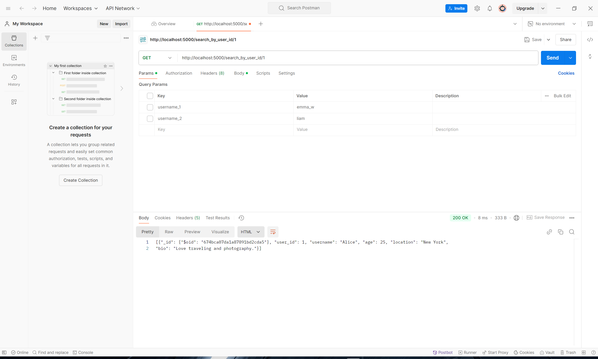
</p>

**2. Create**
- **End point**: `/create/{collection}` (POST)
- **Purpose**: Creates a new data into a certain collection in the database (We use user as an example).
- **Input Fields**:
    - `user_id`: Unique identifier for the user.
    - `username`, `age`, `location`, `bio`: Additional details about the user.

Example Requests:
<p align="center">
  
</p>
If you're adding existing user(s), the respose would be:
<p align="center">
  
</p>

**3. Delete by ID**
- **Endpoint**: `/delete_by_{collection}_id` (DELETE)
- **Purpose**: Deletes an existing data by their id in a certain collection (We use user as an example).
- **Input Fields**:
    - `user_id`: Unique identifier of the user to be deleted.

Example Request:
<p align="center">
  
</p>
If you're deleting a nonexistent user, the respose would be:
<p align="center">
  
</p>

**4. Update**
- **Endpoint**: `/update_by_user_name` (PUT)
- **Purpose**: Updates details of data using their username or ID in a certain collection (We use user as an example).
- **Input Fields**:
    - `username`: The name of the user to be updated.
    - Fields to update: `age`, `location`, or any other user attributes.

Example Requests:
<p align="center">
  
</p>

**5. Create Post**
- **Endpoint**: `/newpost` (POST)
- **Purpose**: Creates a new post by a user.
- **Input Fields**:
    - `post_id`, `user_id`, `content`, `topic`, `timestamp`

Example Request:
<p align="center">
  
</p>

**6. Search Posts by Timestamp**
- **Endpoint**: `/query_by_timestamp` (GET)
- **Purpose**: Retrieves posts created within a specific time range.
- **Query Parameters**:
    - `min_timestamp`, `max_timestamp`

Example Request:
<p align="center">
  
</p>

**7. Query Friends by Username**
- **Endpoint**: `/query_friends` (GET)
- **Purpose**: Retrieves a list of friends for the given username.
- **Input Fields**:
    - `username`

Example Request:
<p align="center">
  
</p>

**8. Analytical Queries**
#### a. By top posts:
- **Endpoint**: `/query_top_posts` (GET)
- **Purpose**: Retrieves the top 3 posts with the highest like counts.

Example Request:
<p align="center">
  
</p>

#### b. By interests:
- **Endpoint**: `/query_most_common_interest` (GET)
- **Purpose**: Finds the most common interest across users.

Example Request:
<p align="center">
  
</p>

## **Neo4j Schema Design**
### Neo4j Queries:
We use Neo4j to store data related to user relationships and interactions, which benefit from graph-based modeling:

#### Nodes
**1. User Node**
- Properties: `user_id`, `username`, `age`, `location`, `bio`.

**2. Post Node**
- Properties: `post_id`, `user_id`, `content`, `topic`, `timestamp`, `hashtags`.

**3. Interest Node**
- Properties: `interest_id`, `interest_name`, `description`.

**4. Comment Node**
- Properties: `comment_id`, `post_id`, `user_id`, `content`, `timestamp`.

#### Relationships:
- Is_friend_of: `(User)-[:Is_friend_of {timestamp}]->(User)`

- Posted: `(User)-[:Posted {timestamp}]->(Post)`

- Is_interested_in: `(User)-[:Is_interested_in {timestamp}]->(Interest)`

- Publish: `(User)-[:Publish {timestamp}]->(Comment)`

- Is_on: `(Comment)-[:Is_on {timestamp}]->(Post)`

- Like: `(User)-[:Like {timestamp}]->(Post)`
------------
<p align="center">
  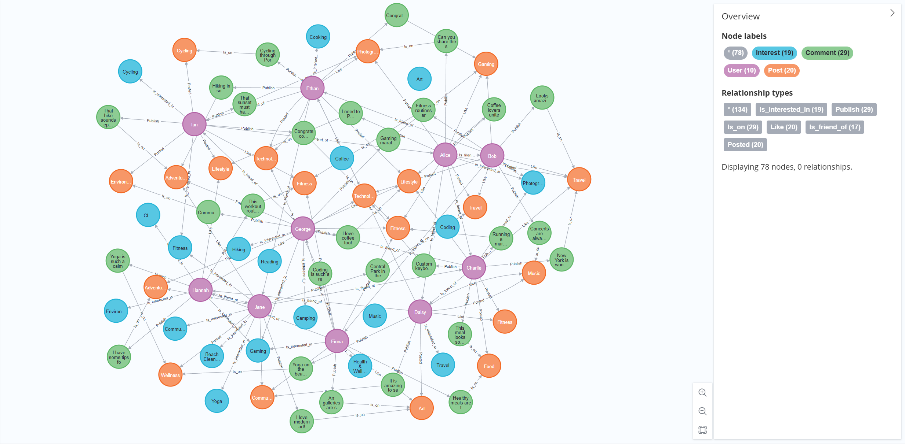
</p>

## API Endpoints
### Neo4j Queries
**0. Import Data**
- **Endpoint**: `/neo4j/initialize` (POST)
<p align="center">
  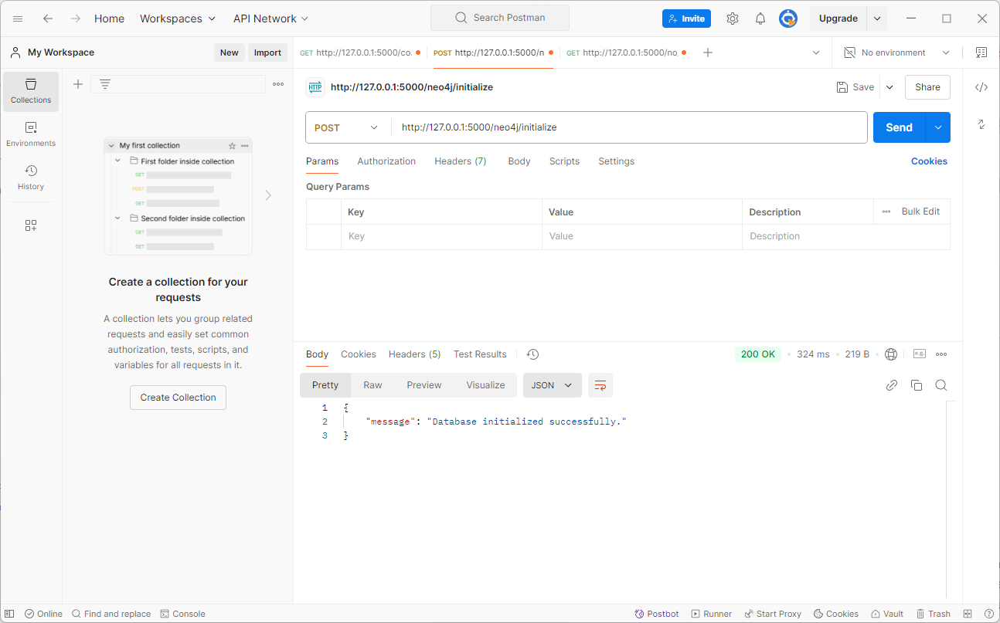
</p>

**1. User Interaction Analysis**
- **Endpoint**: `/top_interactor` (GET)
- **Description**: Identifies the top 5 users based on the number of relationships they have within the network.
- **Explanation**: This query counts all types of relationships (edges) for each user and orders them in descending order to find the most connected users. It helps to understand **who the most active or influential users** are based on their **social connectivity**.

Example Request:
<p align="center">
  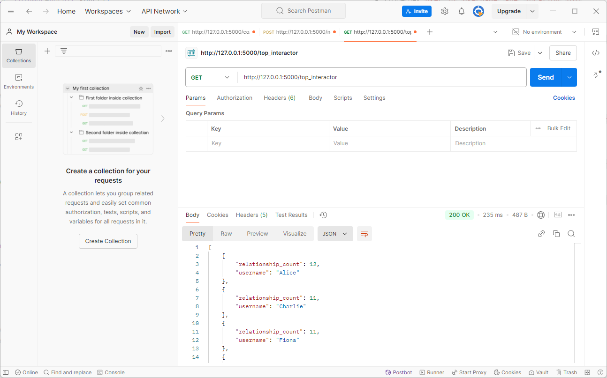
</p>

**2. Interest-based Grouping**
- **Endpoint**: `/interest_based_grouping` (GET)
- **Description**: Groups users by shared interests, showing which users are interested in similar topics.
- **Explanation**: This query matches users to their interests and collects users under each interest. It can be used to identify communities or clusters of users who share similar passions, aiding in social feature development such as group suggestions.

Example Request:
<p align="center">
  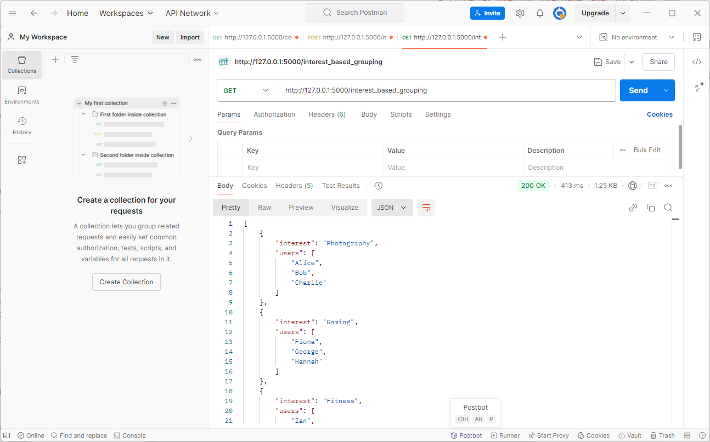
</p>

**3. Content Recommendation**
- **Endpoint**: `/content_recommendation` (GET)
- **Query Parameter**: `username` (e.g., "Alice")
- **Description**: Recommends new content to a user based on shared interests with other users.
- **Explanation**: This query first finds other users who have the highest number of common interests with the specified user. Then, it fetches the latest posts made by those users. This recommendation logic helps tailor content to users by connecting them with posts from like-minded individuals.

Example Request:
<p align="center">
  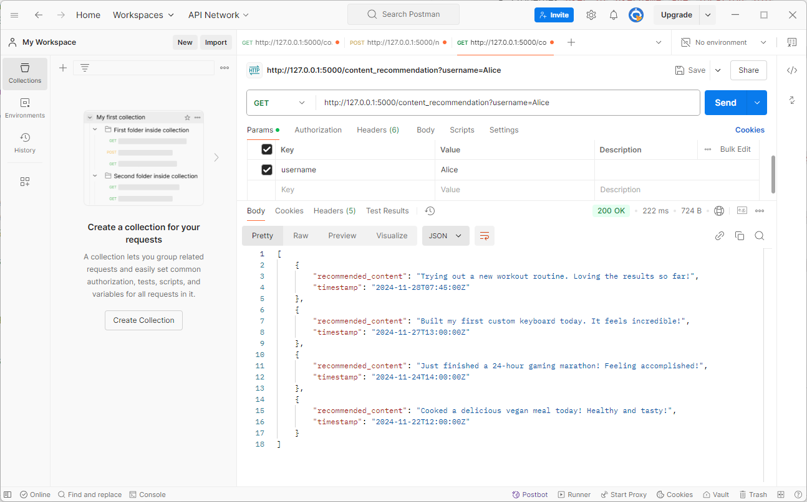
</p>

This recommendation query works by 2 steps:
1. Finding Users with Shared Interests:
- It matches the given user to other users who share common interests.
- Users are sorted by the number of shared interests, select top 5.
2. Fetching Relevant Content:
- Retrieve posts of those selected users with common interests.
- The posts are sorted by timestamp, with the top 5 most recent posts returned as recommendations.

Return 400 if `username` missed:
<p align="center">
  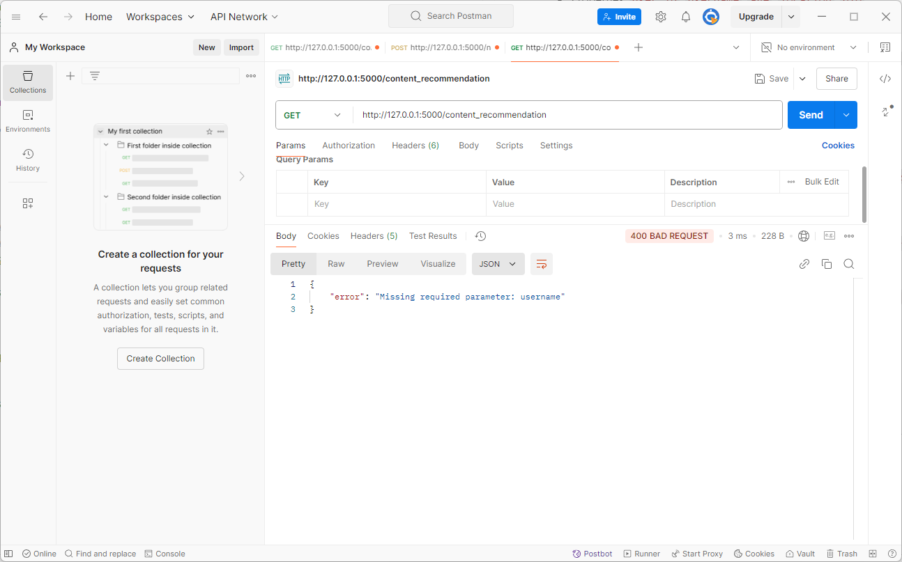
</p>

**4. Popular Topics Analysis**
- **Endpoint**: `/popular_topics_analysis` (GET)
- **Description**: Analyzes trending topics by counting the frequency of specific hashtags in recent posts.
- **Explanation**: The query extracts hashtags from posts and counts their occurrences to determine the most popular topics. This is useful for understanding trending interests and can help the platform promote relevant content or inform users about trending topics.

Example Request:
<p align="center">
  
</p>

**5. Friendship Chain Finder**
- **Endpoint**: `/friend_chain` (GET)
- **Query Parameters**:
    - `username_1` (e.g., "Fiona")
    - `username_2` (e.g., "Jane")
- **Description**: Finds the **shortest path** between two users through friendship.
- **Explanation**: It can be used to analyze social closeness and recommend mutual friends.

Example Request:
<p align="center">
  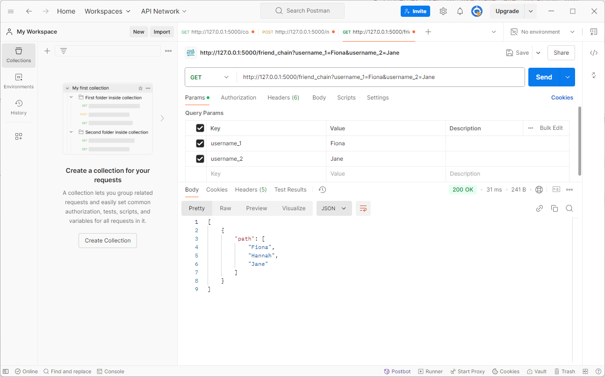
</p>

**6. User Engagement Metrics**
- **Endpoint**: `/user_engagement_metrics` (GET)
- **Description**: Tracks engagement metrics, showing the top 5 posts with the highest number of engagements.
- **Explanation**: This query returns posts sorted by their engagement counts (such as likes). This feature helps identify popular content and can be used to encourage further user interaction by highlighting well-liked posts.

Example Request:
<p align="center">
  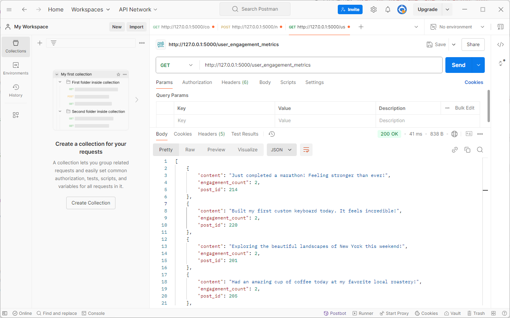
</p>

**7. Influential Users**
- **Endpoint**: `/influential_users` (GET)
- **Description**: Identifies top users based on engagement metrics, such as the number of likes on posts.
- **Explanation**: This query ranks users based on how much interaction (likes) they generate, highlighting the most influential figures in the social network. It can help to prioritize content visibility for these users.

Example Request:
<p align="center">
  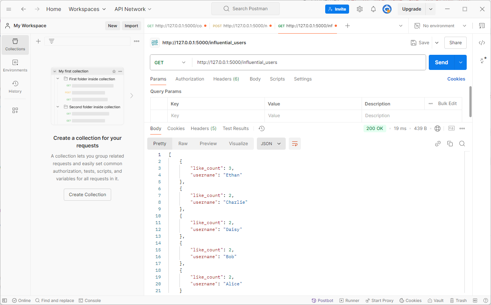
</p>

**8. Common Interests Between Two Users**
- **Endpoint**: `/common_interests` (GET)
- **Description**: Finds shared interests between two specified users.
- **Query Parameters**:
    - `user_id_1`: The ID of the first user.
    - `user_id_2`: The ID of the second user.

Example Request:
<p align="center">
  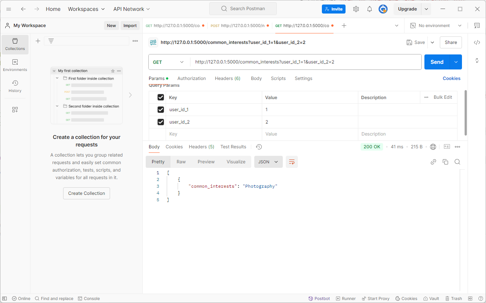
</p>

9. No Active Users
- **Endpoint**: `/no_active_users` (GET)
- **Description**: Retrieves users with no recent activity, marking them as inactive.
- **Explanation**: This query finds users who haven't participated in any relationships (e.g., posts, likes). This information can be used to develop re-engagement strategies for the platform.

Example Request:
<p align="center">
  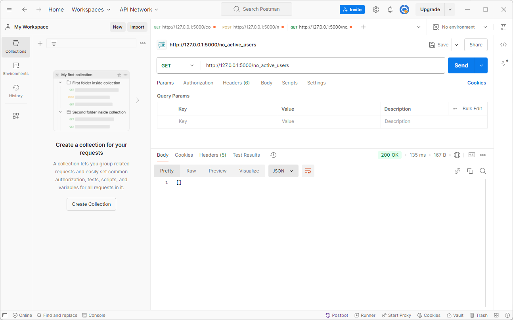
</p>