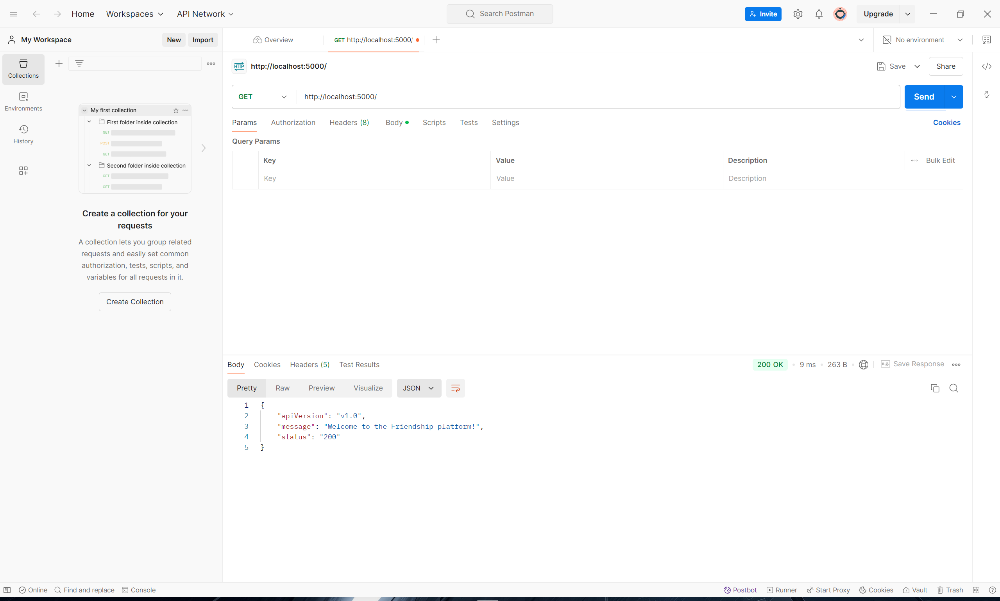
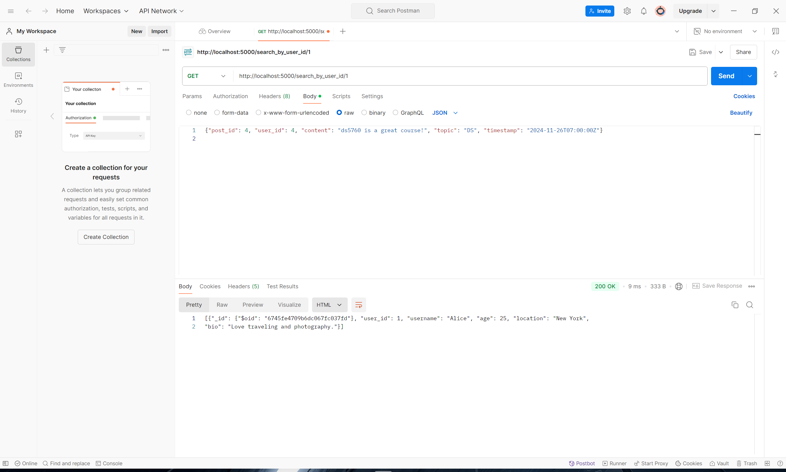
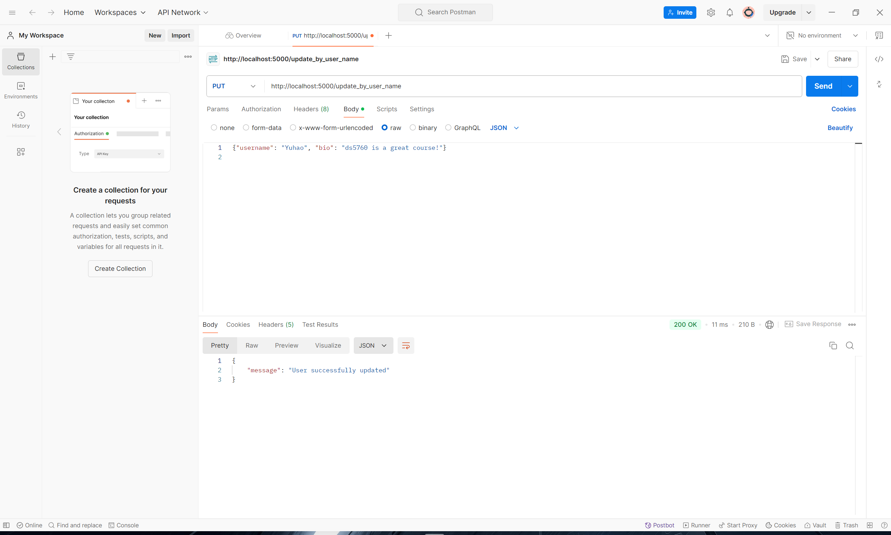
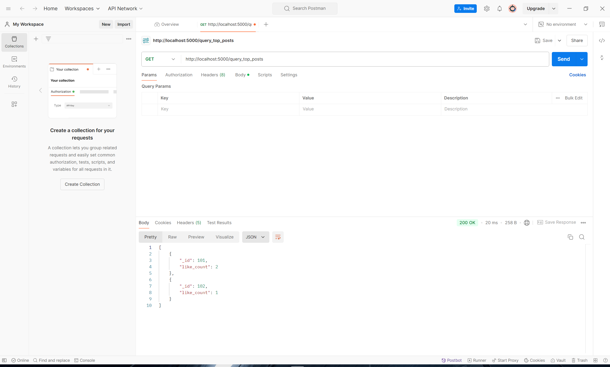
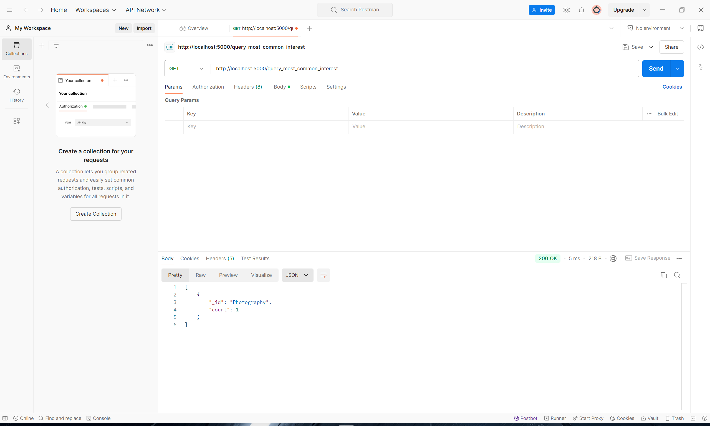

# **Friendship Platform**

## **Overview**
The Friendship Platform is a social media platform. It built with Flask, MongoDB and Neo4j to manage user interactions, posts, interests, friendships, likes, and comments. In this platform, user information and published information can be stored. Not only that, the platform is also expected to help users inquire about interaction, interests, and other related issues to enhance user experiences. It also enables the platform to have a better understanding including but not limited to users' behavior, hot topics, etc.

## **Design schema**
1. MongoDB
- User collection: This collection records the specific information of all users.

Properties: user_id, username, age, location and bio

- Post collection: This collection records the specific information of all posts.

Properties: post_id, user_id, content, topic and timestamp

- Interest collection: This collection records the specific information of all interest.

Properties: interest_id, user_id, interest_name, description and timestamp

- Friendship collection: This collection records all friendships between two users.

Properties: user_id_1, username_1, user_id_2, username_2 and timestamp

- Like collection: This collection records all likes for post.

Properties: like_id, user_id, post_id and timestamp

- Comment collection: This collection records the specific information of all comments for post.

Properties: comment_id, post_id, user_id, content and timestamp

---

2. Neo4j

Type of nodes:
- User: This node records the specific information of all users.

Properties: user_id, username, age, location and bio

- Post: This node records the specific information of all posts.

Properties: post_id, user_id, content, topic and timestamp

- Interest: This node records the specific information of all interest.

Properties: interest_id, user_id, interest_name, description and timestamp

- Comment: This node records the specific information of all comments for post.

Properties: comment_id, post_id, user_id, content and timestamp

---

Type of edges:
- Is_friend_of (User to User): This edge represents that two users are friends.

Properties: timestamp

- Posted (User to Post): This edge represents users who have posted content.

Properties: timestamp

- Is_interest_in (User to Interest): This edge represents which field the user is interested in.

Properties: timestamp

- Like (User to Post): This edge represents that user like the post.

Properties: timestamp

- Publish (User to Comment): This edge represents that user publish the comment.

Properties: timestamp

- Is_on (Comment to Post): This edge represents that comment is on the post.

Properties: timestamp

## API Endpoints
1. Homepage
* URL: GET http://localhost:5000/
* Output is 
{
    'apiVersion': 'v1.0',
    "message": "Welcome to the Friendship platform!"
    'status': '200'
}

2. Create
* URL: POST http://localhost:5000/create/{collection}
* Input is a detail data of corresponding collection. All collections can be used.
* Normal output will show '{collection} successfully created'. If user miss required elements, then it will print error 400, Missing required elements. If there are other errors, error 500 or error 404 (not found) will be returned.

3. Search
* URL: GET http://localhost:5000/search_by_{collection}_id/<{collection}_id>
* Input is id. Id will follows /search_by_{collection}_id/. Only user, post, and interest collections can be used here.
* Normal output is detail information of corresponding id. If id doesn't exist, then it will print error 404, No This {collection}. If there are other errors, error 500 or error 404 (not found) will be returned.

4. Update
* URL: PUT http://localhost:5000/update_by_{collection}_id
* Input is id and new information. Only user, post, and comment collections can be used here.
* Normal output is Job successfully updated. If id doesn't exist, then it will print error 400, Id is required. If id doesn't be found in database, then it will print error 304, Job not found. If there are other errors, error 500 or error 404 (not found) will be returned.

5. Delete
* URL: DELETE http://localhost:5000/delete_by_{collection}_id
* Input is/are id(s). All collections can be used.
* Normal output is 204. If id doesn't exist, then it will print error 400, ID is required. If id doesn't be found in database, then it will print error 304, {collection} not found. If there are other errors, error 500 or error 404 (not found) will be returned.

6. Query by timestamp
* URL: GET http://localhost:5000/query_by_timestamp
* Input are min_timestamp and max_timestamp.
* Normal output is all posts with timestamps between min_timestamp and max_timestamp. If min_timestamp or max_timestamp is missing, it will return error 400. If there are other errors, error 500 will be returned.

7. Query top posts
* URL: GET http://localhost:5000/query_top_posts
* Function to query the top 3 most popular posts. The popularity of a post is determined by the number of likes. Output is a ranked list of post IDs and their like counts. If there are other errors, error 500 will be returned.

8. Query most common interest
* URL: GET http://localhost:5000/query_most_common_interest
* Function to query the top 3 most common interest. The popularity of a interest is determined by the number of likes. Output is a interest and its like counts. If there are other errors, error 500 will be returned.

9. Query friends
* URL: GET http://localhost:5000/query_friends
* Input is username.
* Output is a list of usernames for the user's friends.

