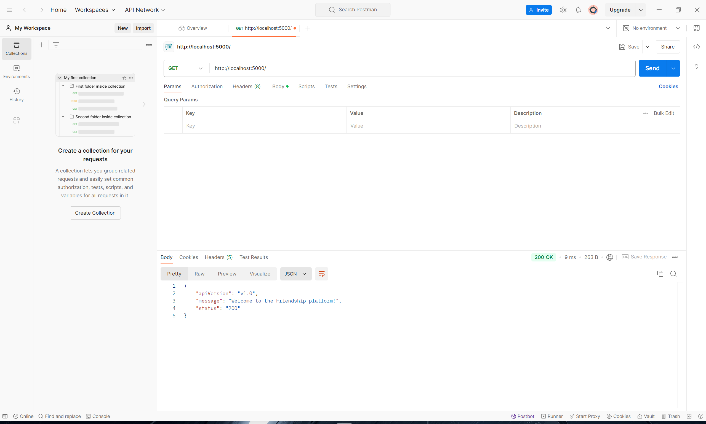
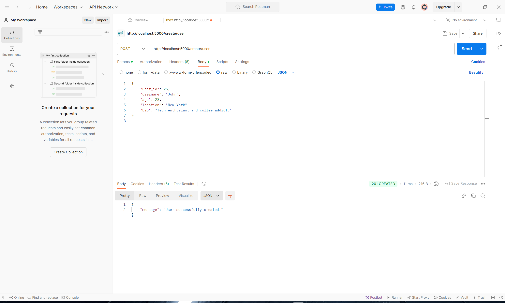
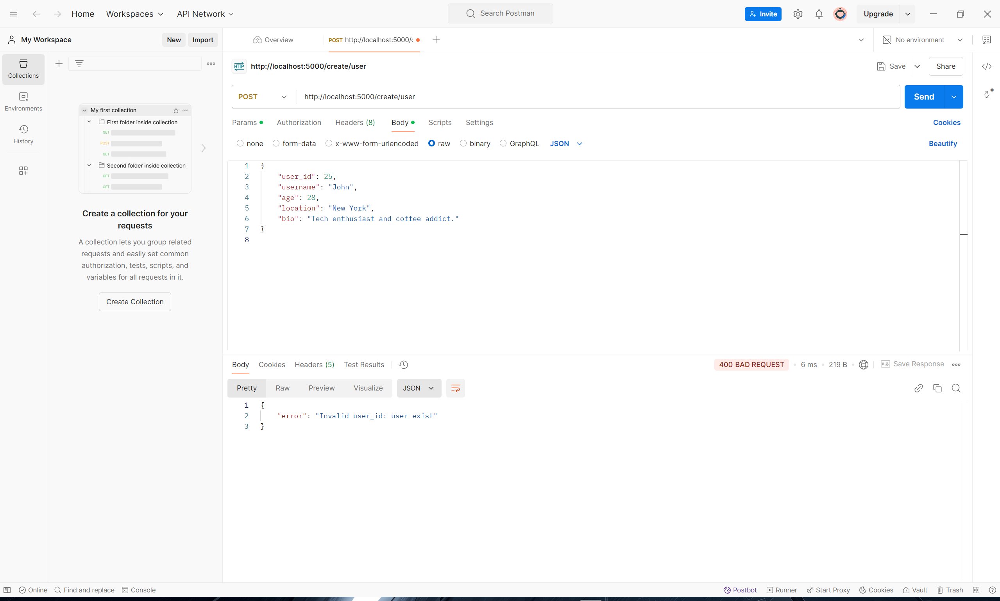
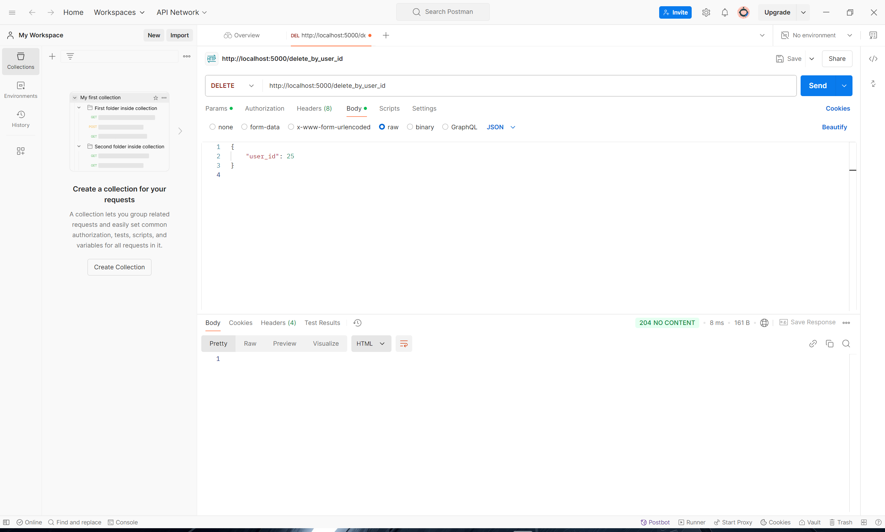
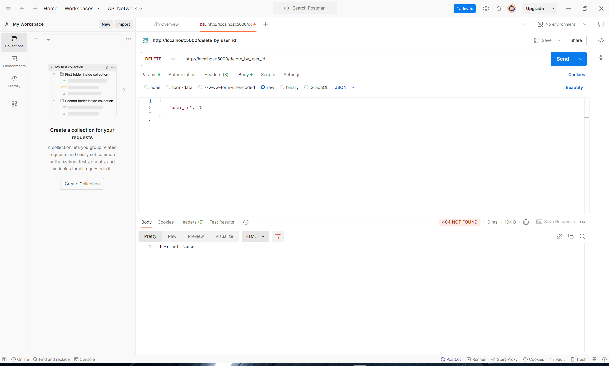
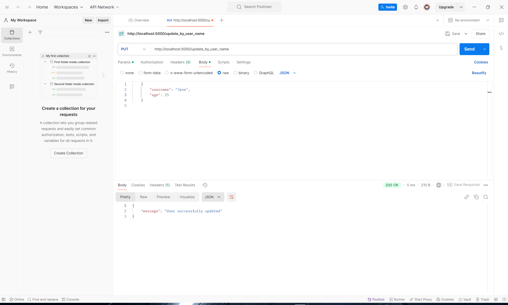
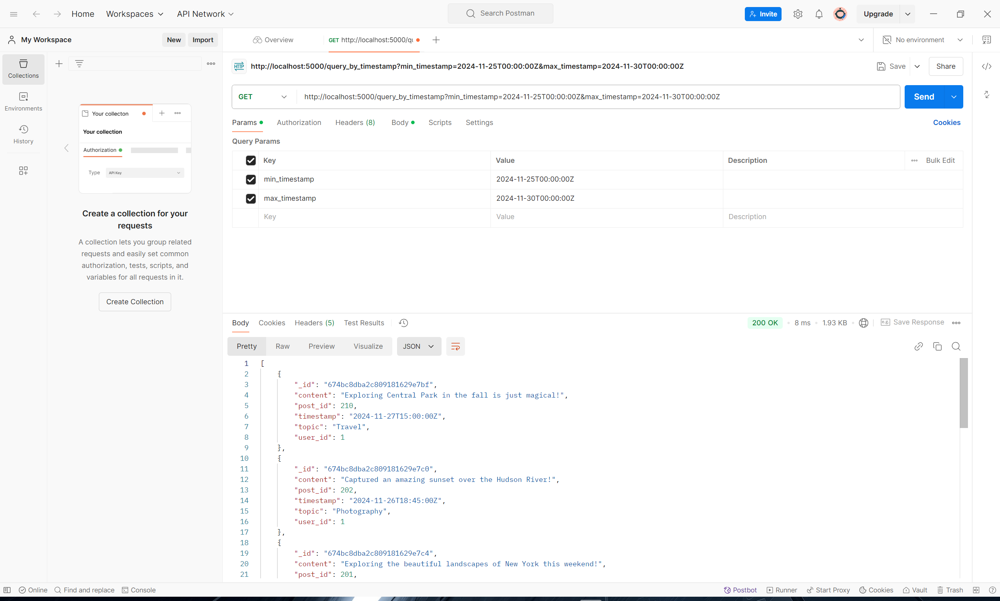
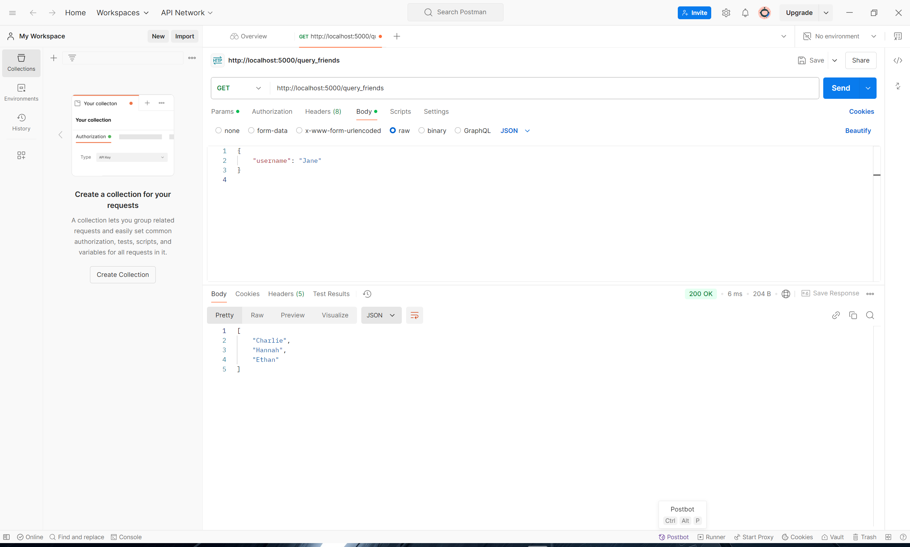
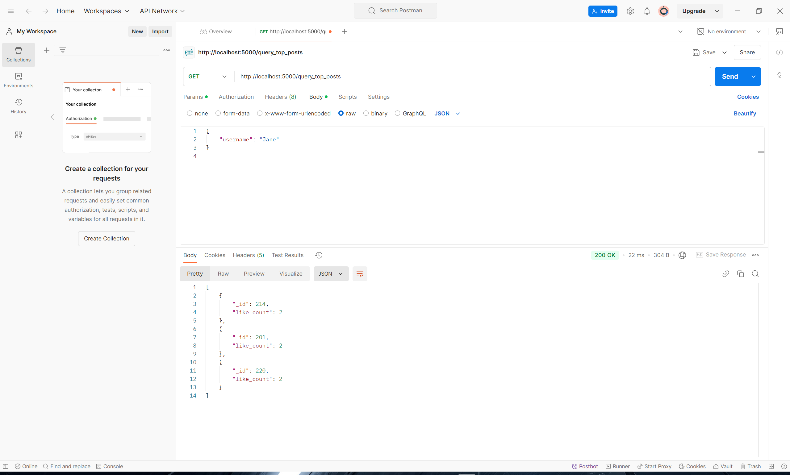

# **Social Media Platform Application**

## **Overview**
Our project is a social media platform that uses two types of databases: **MongoDB** and **Neo4j**. The platform stores user information, posts, interests, friendships, and interactions. This design provides both flexibility in data modeling and an efficient way to manage relationships and interactions between users.

As a document-based database, MongoDB handles the user profiles, posts, comments, likes, and general information that is more naturally represented in a tabular or document format. This includes operations like **creating** users, **posting** content, and **deleting** records.

Neo4j is a graph-based database allowing us to represent and explore complex relationships among users, posts, and interests effectively. It is particularly useful for graph-based queries, such as **finding the shortest paths between users (friend connections), grouping users by common interests, and recommending content based on user activity**.

We utilizes a Flask backend with endpoints for each query, allowing interaction via the Postman API testing tool. This API approach enables us to demonstrate database queries for both MongoDB and Neo4j while highlighting the strengths of each database system. MongoDB is well-suited for storing independent documents with user-centric operations, while Neo4j performs better in handling connected data.

For example, inserting and updating user data is handled in MongoDB due to its flexibility and simplicity in storing document-like user records. Conversely, queries related to user interactions or interests, such as finding friends or content recommendations, are managed by Neo4j due to its efficiency in managing relationships through graph structures.

## **Schema Design**
### MongoDB
We use MongoDB to store basic user information, posts, interests, and related activities. The collections are as follows:

**1. User Collection**

- `user_id`: Unique identifier for each user.
- `username`, `age`, `location`, `bio`: Personal information.

**2. Post Collection**

- `post_id`: Unique identifier for each post.
- `user_id`: Identifier of the user who created the post.
- `content`, `topic`, `timestamp`: Post details.

**3. Interest Collection**

- `interest_id`: Unique identifier for each interest.
- `user_id`: Identifier of the user associated with the interest.
- `interest_name`, `description`, `timestamp`: Interest details.

**4. Friendship Collection**

- `user_id_1`, `user_id_2`: The two users's id involved in a friendship relationship.
- `username_1`, `username_2`: The two users's name involved in a friendship relationship.
- `timestamp`: Date and time the friendship was established.

**5. Like Collection**

- `like_id`, `user_id`, `post_id`, `timestamp`: Represents likes on posts.

**6. Comment Collection**

- `comment_id`, `post_id`, `user_id`, `content`, `timestamp`: Represents user comments on posts.

### Neo4j
We use Neo4j to store data related to user relationships and interactions, which benefit from graph-based modeling:

#### Nodes
**1. User Node**
- Properties: `user_id`, `username`, `age`, `location`, `bio`.

**2. Post Node**
- Properties: `post_id`, `user_id`, `content`, `topic`, `timestamp`, `hashtags`.

**3. Interest Node**
- Properties: `interest_id`, `interest_name`, `description`.

**4. Comment Node**
- Properties: `comment_id`, `post_id`, `user_id`, `content`, `timestamp`.

#### Relationships:
- Is_friend_of: `(User)-[:Is_friend_of {timestamp}]->(User)`

- Posted: `(User)-[:Posted {timestamp}]->(Post)`

- Is_interested_in: `(User)-[:Is_interested_in {timestamp}]->(Interest)`

- Publish: `(User)-[:Publish {timestamp}]->(Comment)`

- Is_on: `(Comment)-[:Is_on {timestamp}]->(Post)`

- Like: `(User)-[:Like {timestamp}]->(Post)`

## API Endpoints
### MongoDB Queries

**0. Homepage**
- **URL**: `http://localhost:5000/` (GET)

  

**1. Create User**
- **End point**: `/create/{collection}` (POST)
- **Purpose**: Creates a new data into a certain collection in the database (We use user as an example).
- **Input Fields**:
    - `user_id`: Unique identifier for the user.
    - `username`, `age`, `location`, `bio`: Additional details about the user.

Example Requests:

  

If you're adding existing user(s), the respose would be:

  

**2. Delete User by ID**
- **Endpoint**: `/delete_by_user_id` (DELETE)
- **Purpose**: Deletes an existing user by their user_id.
- **Input Fields**:
    - `user_id`: Unique identifier of the user to be deleted.

Example Request:

  

If you're deleting a nonexistent user, the respose would be:

  

**3. Update User by Username**
- **Endpoint**: `/update_by_user_name` (PUT)
- **Purpose**: Updates details of a user using their username.
- **Input Fields**:
    - `username`: The name of the user to be updated.
    - Fields to update: `age`, `location`, or any other user attributes.

Example Requests:

  

**4. Create Post**
- **Endpoint**: `/newpost` (POST)
- **Purpose**: Creates a new post by a user.
- **Input Fields**:
    - `post_id`, `user_id`, `content`, `topic`, `timestamp`

Example Request:

  

**5. Search Posts by Timestamp**
- **Endpoint**: `/query_by_timestamp` (GET)
- **Purpose**: Retrieves posts created within a specific time range.
- **Query Parameters**:
    - `min_timestamp`, `max_timestamp`

Example Request:

  

**6. Query Friends by Username**
- **Endpoint**: `/query_friends` (GET)
- **Purpose**: Retrieves a list of friends for the given username.
- **Input Fields**:
    - `username`

Example Request:

  

**7. Analytical Queries**
#### a. By top posts:
- **Endpoint**: `/query_top_posts ` (GET)
- **Purpose**: Retrieves the top 3 posts with the highest like counts.
- **Input Fields**:
    - `username`

Example Request:

  

#### b. By interests:
- **Endpoint**: `/query_most_common_interest  ` (GET)
- **Purpose**: Finds the most common interest across users.

Example Request:

  

